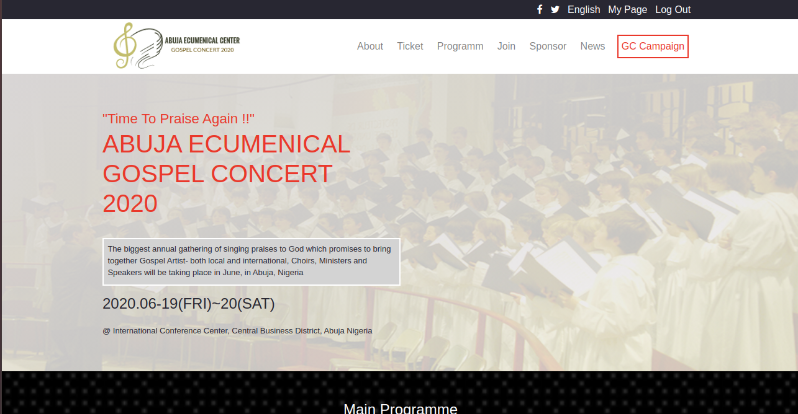

# HTML and CSS capstone project

This project is the coding of a fictitious online music concert. This is my HTML and CSS capstone projec.

# Preview

# Additional description about the project and its features

The purpose of this project is to put into practice all the technical skill I have learnt in HTML and CSS module of microverse fullstack developer program. The essence is to built a website according to design specification within a time frame.

## Webpage Layout

The website has three different webpages the homepage-index.html, about page, and ticket page. Each page contains different sections and units arranged according to page content. Bootstrap framework, Flex box and CSS grid are used in setting up the pages. Each page is fully responsive and can adjust automatically extra-small screen, medium, large, and extra-large screen-displaying specified contents of the website according to the design.

## Further Description of Each Page

## The Home Page

The Home page contains bold description of the website purpose. It highlights a gospel music concert organized by Abuja Ecumenical Center to be hosted at international conference center, Abuja, Nigeria. It also contains the date of the event. Next is the list of activities to be featured in this concert. They include Lecture, Gospel Concert Exhibition, Forum, Seminar and opportunity for Networking. It also contains list of artists and bands that will feature as well as more detail about them as listed on the page. The partner and affiliates logos are displayed as weell. These are the groups sponsoring this concert in different ways. The concert logo is displayed in the footer also. The home page can be accessed from either the about or ticket tabs (for the purpose of this project) by clicking the concert logo at the top left hand side of the navigation area. This page is fully responsive across device with different width.

## The About Page

You can access the about page from the home page by clicking the About tab in the navigation area. The page contains detail description of this gospel music concert. It is an anuual event just for the purpose of worshipping God and identifying talents. Other reasons and the driving force behind this program are explained briefly here. It also contains the contact information for enquiry. Next is the process of used in selecting the logo and the reason behind chosing it as well as the meaning of the logo. It also contains highlight picture of the past two concert. The partner logo are also displayed in this page.

## The Ticket Page

This page displays the various ticket available for this concert. Depending on the category you belong, Normal participant or a chorister, the price as well as your choice of date are listed. You have the opportunity to also select your menu for launch during this concert as displayed as well.

## Footer

The footer contains the concert logo and copyright year and can be seen in most of the pages.

## Built With

- HTML5
- CSS3
- Bootstrap4
- CSS Flex box
- CSS Grid

## Live Demo

[Live Demo Link](https://rawcdn.githack.com/Zubenna/gospel-concert/2e95cdd4e8669955048a8ea2b8233c21192c3088/index.html) hosted on [githack](https://raw.githack.com)

## CDNs

- https://fontawesome.com/icons
- https://stackpath.bootstrapcdn.com/bootstrap/4.4.1
- https://cdnjs.cloudflare.com/ajax/libs/font-awesome/4.7.0

## Steps For Installation

- After cloning this repo, git clone [repo](https://github.com/Zubenna/gospel-concert/tree/feature-branch), cd into gospel-concert folder.
- Open the index.html file in your favourite browser, and that's it!!!

## Author

- Github: [Nnamdi](https://github.com/zubenna)
- Twitter: [Nnamdi](https://twitter.com/zubenna)
- Linkedin: [Nnamdi](https://linkedin.com/in/nnamdi-emelu-08b14340/)

## 🤝 Contributing

Special Thanks to Cindy Shin in Behance for this creative design.
Contributions, issues and feature requests are welcome!
Feel free to check the [issues page](issues/).

## Show your support

Give a ⭐️ if you like this project!

## Acknowledgments

- Inspiration, etc
